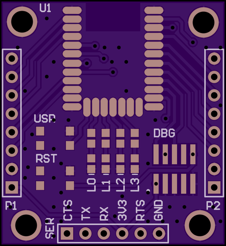
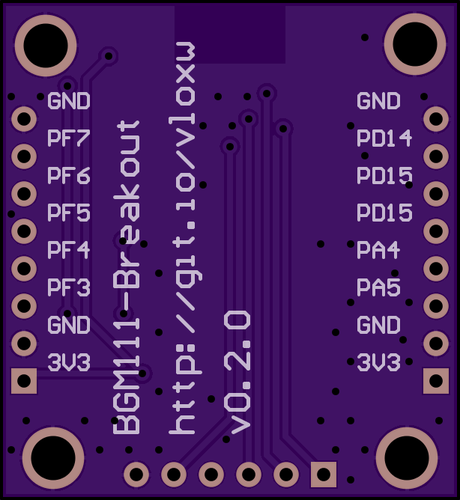

# BGM111-Breakout
A minimal breakout for the [recently released](https://www.silabs.com/products/wireless/bluetooth/Pages/bluegecko-bluetooth-smart-module-intro.aspx) Silabs/BlueGiga [BGM111](https://www.silabs.com/products/wireless/bluetooth/Pages/BGM111-bluetooth-smart-module.aspx) BLE module.

This exposes the serial port for communication and control via [BGApi/BBGLib](http://community.silabs.com/t5/Wireless-Knowledge-Base/REFERENCE-BGAPI-BGLib-Implementation-on-BLE-devices/ta-p/147774), a [cortex-m standard](http://infocenter.arm.com/help/topic/com.arm.doc.faqs/attached/13634/cortex_debug_connectors.pdf) debug connector for programming the onboard ARM core, four user LEDs, a reset button, and a user button (internal pullup required), and a bunch of additional IO in a breadboard-friendly form factor.

Check out the [releases](../../releases) section for current schematics/renderings and gerber packages for upload to your [favourite](https://oshpark.com/) [PCB](https://www.seeedstudio.com/service/index.php?r=pcb) [manufacturer](http://dirtypcbs.com/).

## Top Layer

## Bottom Layer

