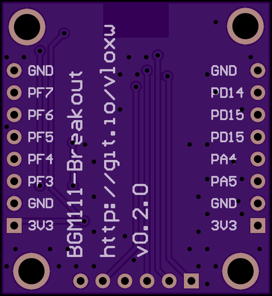

# BGM111-Breakout

A minimal breakout for the [recently released](https://www.silabs.com/products/wireless/bluetooth/Pages/bluegecko-bluetooth-smart-module-intro.aspx) Silabs/BlueGiga [BGM111](https://www.silabs.com/products/wireless/bluetooth/Pages/BGM111-bluetooth-smart-module.aspx) BLE module.

This exposes the serial port for communication and control via [BGApi/BBGLib](http://community.silabs.com/t5/Wireless-Knowledge-Base/REFERENCE-BGAPI-BGLib-Implementation-on-BLE-devices/ta-p/147774), a [cortex-m standard](http://infocenter.arm.com/help/topic/com.arm.doc.faqs/attached/13634/cortex_debug_connectors.pdf) debug connector for programming the onboard ARM core, four user LEDs, a reset button, and a user button (internal pullup required), and a bunch of additional IO in a breadboard-friendly form factor.

Check out the [releases](../../releases) section for current schematics/renderings and gerber packages for upload to your [favourite](https://oshpark.com/) [PCB](https://www.seeedstudio.com/service/index.php?r=pcb) [manufacturer](http://dirtypcbs.com/).

Boards from OSHPark can be ordered [here](https://oshpark.com/shared_projects/ZKBud2br)

## Getting Started

You will need an [ARM programmer](https://www.segger.com/jlink-debug-probes.html) with support for the silabs ARM core onboard, as well as a cortex-m [debug adaptor](https://www.olimex.com/Products/ARM/JTAG/ARM-JTAG-20-10/).

The Silabs management software is required (even when using BGLib/BGApi) to load the BLE profile onto the device, this is available [here](https://www.silabs.com/products/wireless/bluetooth/pages/bluetooth-getting-started.aspx).

You will also need a [microcontroller](https://www.arduino.cc/) or a [serial adaptor](https://www.sparkfun.com/products/9873) to control to the device (unless it is only to be used as a beacon). It is important to use a 3v3 micro or serial adaptor to ensure you do not exceed the allowable supply voltage for the BGM111.

## PCB

### Top Layer

### Bottom Layer

